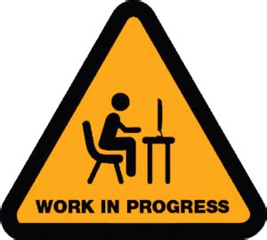

# React Design System

**WORK IN PROGRESS**



My custom design system on top of [MUI](https://mui.com/material-ui/), with a bunch of components to be able to fast prototype new pages and products

## ⚠️ Important Notice

**This is a personal design system** built for my own projects and experimentation.

- **Breaking changes are expected** and may occur at any time without notice
- **Not recommended for production use** in external projects
- **Best used as a reference**: Study the patterns, component structure, and testing approaches to build your own design system
- API stability is not guaranteed between versions

If you choose to use this library, I strongly recommend forking it or using it as inspiration for your own custom design system rather than depending on it directly.

## Installation

This project is available as an [npm package](https://www.npmjs.com/package/@pautena/react-design-system).

npm:

```bash
npm install @pautena/react-design-system @emotion/react @emotion/styled @mui/icons-material @mui/material @mui/x-data-grid
```

Now you are going to be able to import the components and use it in your React project.

```javascript
import { Badge, DrawerLayout } from "@pautena/react-design-system";
```

For shadcn/base-ui styles and CSS variables, import the package stylesheet once in your app entrypoint (for example `src/main.tsx` in Vite):

```javascript
import "@pautena/react-design-system/global.css";
```

## Documentation

If you want to know more about the components and the layouts availables in this project check our [documentation](https://pautena.com/react-design-system)

## Examples

See Storybook → Examples for full demos.

## AI Documentation

See Storybook → Examples for AI usage guides.

- [llms.txt](./llms.txt)

## Contributing

Read the [contribution guide](/CONTRIBUTING.md) to learn about our development process, how to propose bug fixes and improvements, and how to build and test your changes.

## Issues and features

If you found a bug or you have an idea for a new component, feel free to [open an issue](https://github.com/pautena/react-design-system/issues/new) explaining the bug or the new component that you would like to have.

## Licence

This project is licensed under the terms of the [MIT license](/LICENSE).
